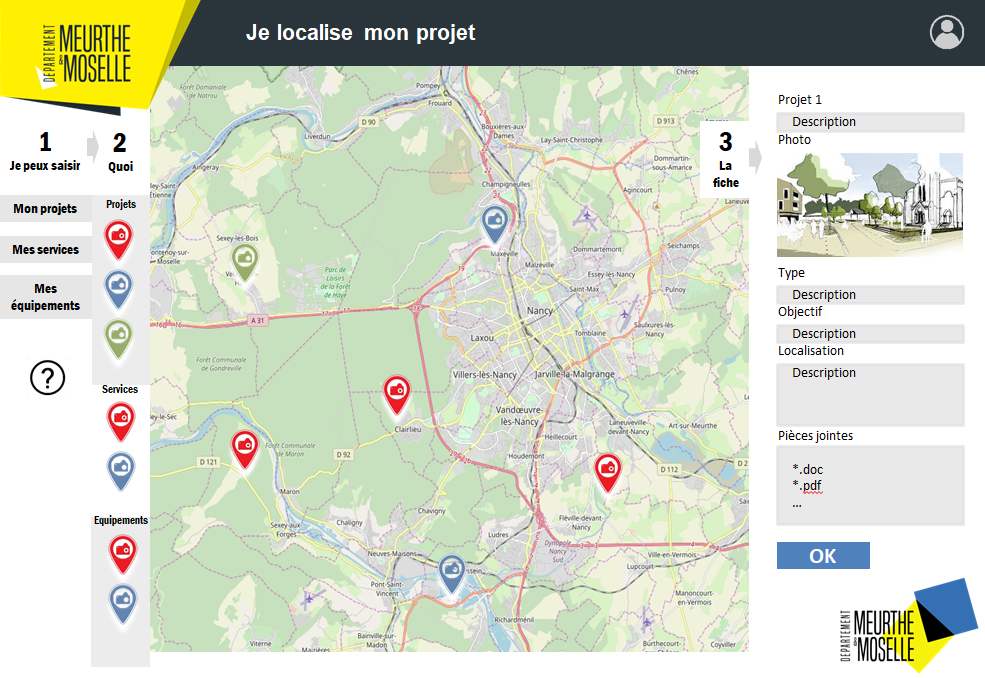

# Améliorations apportées
___D’octobre à décembre___
## Remise en forme du CSS
Ma première mission a été de faire correspondre l'application à la maquette que mon tuteur m'a donné. Cela m'a permis de parcourir entre les différents composants pour mieux connaître leur rôle et leur fonctionnement.


<p style="text-align:center;">Première version de la maquette</p>

J'ai ainsi utilisé flexbox et grid, et j'ai adapté l'application au format d'écran plus petit comme les mobiles (responsive design), en suivant le wireframe suivant :

<div style="color:red">img du/des wireframe(s)</div>

Nous pouvons voir que le menu des couches en version mobile est un carrousel (ou slider) horizontal. J'ai choisi d'utilisé `Swiperjs`, une librairie de slider compatible avec le mobile et qui propose une personnalisation assez complète.

## Editable
__Problème :__ Modifier la géométrie d’un polygone

Pour modifier un polygone nous avons 2 choix :
- Soit cliquer pour ajouter un point à la suite du dernier point posé. Cependant il n'est pas possible de déplacer ou supprimer un point déjà existant ou d’en ajouter un nouveau entre deux déjà existants.
- Soit supprimer l'objet et le recréer, mais on perd toutes les données de sa fiche.

__Idée__ : Pouvoir déplacer ou supprimer un point déjà existant ou en ajouter un entre 2 sans avoir à supprimer l’objet

__Solution__ : Le plugin [`Leaflet Editable`](https://github.com/Leaflet/Leaflet.Editable)

__Problème intermédiaire :__ Coordonnées dupliquées
Lorsque l’on sauvegarde un objet, la première coordonnée est dupliquée ce qui nous fait 2 points se superposant (cela se produisant à chaque sauvegarde). 

PostGIS considère en polygone valide que si la première coordonnée est identique à la dernière (pour pouvoir refermer la forme), contrairement Leaflet qui n’ayant pas besoin de ce doublon le considère comme un autre point. 

L’astuce de Hugo était donc de dupliquer cette coordonnée avant de l’envoyer dans la BDD PostGIS. Cependant en recevoir les informations de la BDD, on récupérait le doublon. 

__Solution :__ Retirer le doublon
```javascript
get coordinates () {
    let g = this.properties.geometry;
    if(g.value){
        if ((this.type=='polygon') && (g.value.coordinates.length >= 3)) {
        /*
            Dans le cas où le premier point a été duppliqué
            pour fermer le polygone, on supprime le doublon, 
            qui est le dernier point.
        */
            let firstCoord = g.value.coordinates[0];
            let lastCoord = g.value.coordinates[g.value.coordinates.length -1 ];
            if (firstCoord[0] == lastCoord[0] && firstCoord[1] == lastCoord[1]) {
                g.value.coordinates.pop();
            }                
        }
        return g.value.coordinates
    }else return null;
}
```
## Ligne brisée (Polyline)
L’application ne prenait en compte que les objets de type point (marker) et polygone.

L’implémentation de lignes brisés pour par exemple des routes ou des lignes électriques ou internet était indispensable. Je me suis basé sur ce qui avait été déjà fait pour les polygones et je l'ai adapté aux polylignes que ce soit du côté Leaflet ou pour la structure de la requête vers PostGIS.

Je vais me permettre le néologisme `polyligne` à partir de l’anglais `polyline` (à l'instar de _polygon_ pour  _polygone_) pour désigner les lignes brisées.

## Outils de mesures
Suite à une réunion avec Mme Arts, la directrice du Pôle Développement, pour lui montrer les avancées de l’application, grâce à son point de vue plus global du projet, elle nous avait proposé de nouvelles fonctionnalités : 
- La possibilité de sélectionner différents fonds de carte (par exemple : vue satellite ou vue de plan),
- Des outils pour pouvoir mesurer des périmètres, distances ou surfaces.

### Description des différentes fonctionnalités de mesures
-	Affichage sur les polygones leur aire et périmètre et sur les polylignes la distance totale.
-	Mesure rapide/à la volée de distances ou de surfaces (sans créer un objet dans la BDD).
-	Remplissage automatique des champs d'`aire` et de `périmètre` (pour les polygones) et du champ de `distance` (pour les polylignes).

### Implémentation des outils de mesures
#### Affichage des mesures
Pour l’affichage des mesures sur les objets j’ai utilisé le plugin [`Leaflet Measure Path`](https://github.com/ProminentEdge/leaflet-measure-path) en modifiant l’affichage pour des raisons de lisibilité. 

#### Mesure rapide
Pour les outils de mesures rapides, j’ai créé un nouveau module dans le store de VueJs nommé `quickMeasure` qui stocke l’objet Leaflet en construction, les méthodes pour ajouter, modifier et supprimer les sommets de l’objet ainsi que le type d’objet qui est initialisé par ce bouton Image du bouton. Les mesures sont affichées avec le plugin `Leaflet Measure Path` et l’objet est modifiable grâce au plugin `Editable`.


#### Remplissage automatiques des champs
Pour le remplissage automatique des champs, la méthode updateMeasurements est appelée à chaque modification de la géométrie d’un objet et fait la mise à jour automatique des champs aire et périmètre ou distance.

-	Le périmètre est calculé grâce aux méthodes `accumulatedLengths` et `length` du plugin [`Leaflet.GeometryUtil`](https://github.com/makinacorpus/Leaflet.GeometryUtil)
-	L’aire est calculée grâce à la méthode `geodesicArea` du plugin [`Leaflet.Draw`](https://github.com/Leaflet/Leaflet.draw)
-	La distance totale est calculé grâce à `length` du plugin `Leaflet.GeometryUtil`

```javascript
/*
    Méthode appelée à chaque fois que la géométrie d'un objet 
    est modifiée pour mettre à jour les champs de périmètre, 
    d'aire et de distance
*/
updateMeasurements () {
    this._updateByRole('area');
    this._updateByRole('perimetre');
    this._updateByRole('distance');
}

```
<div id="updateByRole">

Dans la méthode `_updateByRole` ci-dessous, on recherche dans le fichier de configuration, les champs `NotEnterable` (cf. [`ajout de types de champs`](#ajout-de-types-de-champ)) de la couche de l'objet.
On regarde ceux qui ont un attribut `rôle` qui correspond au rôle du champ. Pour l'instant il existe 3 rôles :
- `area` pour le calcul d'aire et de surface, 
- `perimetre` pour le calcul de périmètre, 
- `distance` pour le calcul de distance ou de longueur. 

</div>
Puis on appelle le getter correspond au rôle sur l'attribut de la fiche descriptive auxquelles le rôle a été assigné.

```javascript
_updateByRole(role){
    const type = form.notEnterable.find((t) => { 
        return (t.role === role) ? (!t.layer || t.layer === this.parent.description.layer) : null
    });
    if (type && this.properties[type.name]) {
    /*
        Les getters sont nommés comme leur rôle 
        ce qui permet de les appeler comme ceci : this[role]
    */
        this.properties[type.name].value = this[role]
    }
}
```
Voici les getters de chacun des 3 rôles.

```javascript
get perimetre (){
    if (this.representation && this.type == 'polygon') {
        let coordinates = this.representation._latlngs[0];
    /*
        accumulatedLengths() calcule la distance totale
        des segments d'un tableau de coordonnées. 
        Or pour calculer le périmètre d'un polygone,
        il manque le dernier côté entre le premier 
        et le dernier point de ce tableau. 
        On le calcule séparément avec la méthode length
        et on l'ajoute en suite.
    */
        let allSides =  L.GeometryUtil.accumulatedLengths(coordinates);
        let lastSide = L.GeometryUtil.length([coordinates[0], 
                       coordinates[coordinates.length-1]]);
        let perimeter = allSides[allSides.length-1] + lastSide;

        return Math.round(perimeter);
    }
    return null;
}

get area (){
    if (this.representation && this.type == 'polygon') {
        let area = L.GeometryUtil.geodesicArea(this.representation._latlngs[0]);
        return Math.round(area);
    }
    return null;
}

get distance (){
    if (this.representation && this.type == 'polyline') {
    /*
        Contrairement à son utilisation dans get perimeter,
        ici length() reçoit directement une polyligne
        et renvoie la distance totale de la polyligne
    */
        let totalDistance = L.GeometryUtil.length(this.representation);
        return Math.round(totalDistance);
    }
    return null;
}
```
## Configuration du formulaire

Afin de mettre en forme de manière plus avancée le formulaire ou fiche descriptive, j'ai ajouté de nouveaux types de champs dans le formulaire et ajouté de nouveaux attributs aux types déjà existant.

### NotEnterable 
`NotEnterable` (pour non saisissable) concerne tous les champs qui peuvent être affichés mais qui ne doivent pas être saisi par les utilisateurs.

Il peut s’agir par exemple de l’identifiant de l’objet mais aussi et surtout des champs aire, périmètre, longueur que j’ai mentionné dans la partie [`Outils de Mesure`](#outils-de-mesures) qui doivent être modifiés lors d'un changement dans la géométrie de l’objet et non directement dans le formulaire. 

Dans la configuration du champ il est possible d’ajouter l’unité du champ avec l'attribut `unit` (mètres, ou mètre carré, pour le moment), ce qui permet de l’afficher et même de pouvoir convertir les valeurs (m en km ; m² en ha, puis en km²), comme ceci :

```javascript

switch (this.field.unit) {
    case 'metre':
        if (a.value > 1000 ) {
            a.value = Math.round((this.value/1000) * 100)/100;
            a.unit = "km"
        }else a.unit = "m";
        break;
    case 'squareMetre':
        if (a.value > 10**6 ) {
            a.value = Math.round((this.value/10**6) * 10)/10;
            a.unit = "km²"
        }
        else  if (a.value > 10**4) {
            a.value = Math.round((this.value/10**4) * 10)/10;
            a.unit = "ha"
        }
        else a.unit = "m²";
        break;

    default:
        break;
}
return a;
```

Comme préciser dans la partie sur les outils de mesures (cf. [ `updateByRole`](#updateByRole)), un attribut `role` est optionnel et permet de définir le rôle de champ parmi ceux prédéfinis. 

### File et Thumbnail
Le champ Thumbnail permet l’affichage d’une image et le champ File le téléchargement d’un fichier.
S’il n’y pas de fichier alors on affiche un input File pour que l’utilisateur puisse déposer un fichier/image.

__Problème__ :
Une fois que le fichier a été déposé, il faut pouvoir le stocker quelque part.

Deux options s’offrent à moi : 
- le stockage en BDD 
- ou le stockage dans un dossier local.

Après des recherches et après en avoir discuté avec mes collègues, j’arrive à un dilemme : 
- D'un côté, le stockage en BDD pose des problèmes de sécurité, de performances et de capacité de stockages car il s'agit de fichiers binaires assez lourd de type `Blob` (comparé à des champs `text` ou `int`). 
- De l'autre, étant donné que l'application est en `VueJs` et que `JavaScript` ne permet pas la modification des fichiers et de dossiers en local pour (encore une fois), des problèmes de sécurité, je suis aussi bloqué même si cette solution est privilégiée par mes collègues.

En continuant mes recherches je découvre le module `fs` (pour file-system) de `NodeJS`, qui permet la gestion de fichiers et dossiers à partir d’une application `Node`, puis je fais la connaissance d’`Express`, un Framework d’API pour NodeJS. Je décide donc de créer une API REST qui stocke les fichiers et images dans une arborescence précise de dossiers, avec laquelle l'application CartoGIS54 pourra communiquer.
