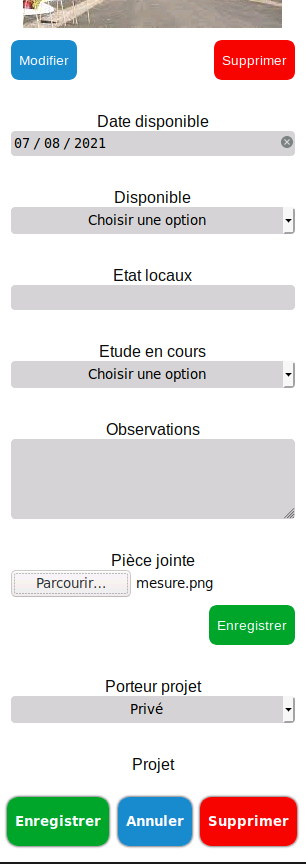
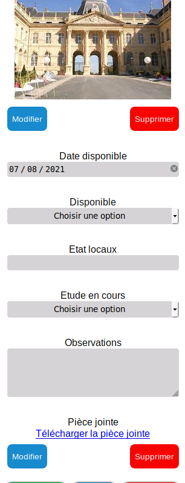

# FileAPI
___De décembre à mars___
## Structure générale de l'API
FileAPI est une `API REST` de gestion de fichiers et images en `NodeJS` pour les besoins de l'application `CartoGIS54`.

::: tip API REST
*Une API est l’acronyme pour Application Programming Interface (ou Interface de Programmation). Une API REST permet la communication depuis des applications clientes extérieures via le protocole HTTP grâce aux méthodes HTTP et à des URI structurées, afin de pouvoir manipuler des données (stockage, restitution, modification).*
:::

### Routes 

Grâce au Framework `Express`, j’ai créé les différentes URI selon les routes suivantes :

#### Test
| Méthode | Route | Rôle | Corps de la requête | Réponse |
|--- | --- | --- | --- | ---
| __`GET`__ | `/ping` | Teste la communication avec l'API | Aucun |  `JSON` : Le succès de la requête

#### Files

| Méthode | Route | Rôle | Corps de la requête | Réponse | 
| --- | --- | --- | --- | --- |
| `GET` | `/:couche/files/:nom` | Restitue un fichier | Aucun | `Blob` : Le fichier | 
| `POST` | `/:couche/files/` | Dépose un nouveau fichier | - `Content-type : multipart/form-data` <br> - Champ `file` : le fichier à déposer | `JSON` : Le nom du dossier et le nouveau nom du fichier qui a été haché | 
| `DELETE` | `/:couche/files/:nom` | Supprime un fichier | Aucun | `JSON` : Un message pour le succès de la requête |
| `PUT` | `/:couche/files/:nom` | Remplace un fichier (en le supprimant) et en déposant un nouveau fichier (nom différent) | - `Content-type : multipart/form-data` <br> - Champ `file` : le nouveau fichier à déposer | `JSON` : Un message pour le succès de la requête ainsi que le nom du dossier et le nouveau nom du fichier qui a été haché | 

#### Images
| Méthode | Route | Rôle | Corps de la requête | Réponse | 
| --- | --- | --- | --- | --- |
| `GET` | `/:couche/images/:nom` | Restitue une image | Aucun | `Blob` : L'image | 
| `POST` | `/:couche/images/` | Dépose une nouvelle image | - `Content-type : multipart/form-data` <br> - Champ `image` : l'image à déposer | `JSON` : Le nom du dossier et le nouveau nom de l'image qui a été haché | 
| `DELETE` | `/:couche/images/:nom` | Supprime une image | Aucun | `JSON` : Un message pour le succès de la requête |
| `PUT` | `/:couche/images/:nom` | Remplace une image (en la supprimant) et en déposant une nouvelle image (nom différent) | - `Content-type : multipart/form-data` <br> - Champ `image` : la nouvelle image à déposer | `JSON` : Un message pour le succès de la requête ainsi que le nom du dossier et le nouveau nom de l’image qui a été haché | 

::: tip Paramètres dans URI
Dans les URI les termes précédant un deux points « : » correspondent à des paramètres : 
-	`couche` correspond au nom de la couche de l’objet 
-	`nom` correspond au nom du fichier (ex : mon_image.png)

:::

::: danger Erreurs 

En cas d’erreurs soit au sein de l’API, dans la structure des requêtes ou dans la faisabilité des requêtes, une erreur au format json sera envoyée au client, avec un message expliquant le problème.

:::

Les données sont stockées dans le dossier data avec l'arborescence suivante : 
```bash
|-- data/
    |-- couche1/
        |-- files/
            |-- unFichierDeLaCouche1.txt
            |-- unAutreDeLaCouche1.pdf
        |-- images/
            |-- uneImageDeLaCouche1.txt
            |-- uneAutreDeLaCouche1.pdf
    |-- couche2/
        |-- files/
            |-- unFichierDeLaCouche2.txt
            |-- unAutreDeLaCouche2.pdf
        |-- images/
            |-- uneImageDeLaCouche2.txt
            |-- uneAutreDeLaCouche2.pdf
```
## Middlewares
::: tip Middlewares
Un middleware est un logiciel qui peut servir à la vérification/validation de données, à l'authentification, etc. Un ou plusieurs middlewares sont appelés entre notre point d'entrée (pour une API les URI/URL) et la méthode de notre contrôleur (qui effectue les actions demandées dans la requête).
::: 

J'ai implémenté plusieurs middlewares afin de vérifier la structure et le contenu des requêtes entrantes.

### express-form-data
Le module [`express-form-data`](https://github.com/ortexx/express-form-data) permet de télécharger les fichiers dans la partie formData de la requête dans un dossier temporaire et d'ainsi changer le corps de la requête en un objet comportant entre autres le chemin vers le fichier temporaire. 

### validate-DTO
::: tip DTO 
DTO pour Data Transfert Object (Objet de Transfert de Données) est un modèle/patron de format de données (ici de nos requêtes). 
:::

Nous devons vérifier la structure du corps des requêtes `POST` et `PUT` avant d'appeler les méthodes correspondant à la requête. Grâce à [`Joi`](https://github.com/sideway/joi), un module de validation de données, nous allons définir des schémas (modèle/patron) du corps et valider le corps de la requête qui a été modifié par express-form-data, avec ceux-ci : si la validation ne passe pas, une erreur `400 BadRequest` sera envoyée avec comme message les erreurs dans la structure de la requête.

Les schémas Joi sont définis :
- [ici pour les fichiers](https://github.com/infogeo54/CartoGIS54-file-API/blob/master/dto/fileSchema.mjs) : on vérifie qu'un fichier a bien été transmis dans le champ `file`, que le chemin vers celui-ci a été renseigné et qu'il est valide dans le champ `path`.
- [ici pour les images](https://github.com/infogeo54/CartoGIS54-file-API/blob/master/dto/imageSchema.mjs) : on vérifie qu'une image a bien été transmise dans le champ `image`, que le chemin vers celle-ci a été renseigné et qu'il est valide dans le champ `path`.

### Type de fichier
Une fois que la structure de la requête a été validée, nous allons vérifier le type de fichier qui nous a été transmis.

#### ImageCheckType 
Pour les images, nous vérifions seulement que le type MIME du fichier correspond bien à "image/", grâce à [`mmmagic`](https://github.com/mscdex/mmmagic). 

#### FileCheckType
Pour les fichiers, nous vérifions que le type MIME du fichier correspond à l'un des types acceptés du fichier de configuration mais que l'extension du fichier ne fait pas partie des extensions rejetées listées aussi dans le fichier de configuration (cf. partie configuration ci-dessous).

## Configuration
FileAPI peut être personnalisée de la même manière que l’application CartoGIS54 grâce à un fichier de configuration. Le fichier `api.config.json` est composé de 2 parties :
- `domainsAllowed` liste les domaines vers lesquels l’API peut communiquer (ajout des Headers CORS),
- `typeCheck` qui permet d’autoriser ou non certains types de fichiers à être stockés. Il est composé : 
    - `acceptedTypes` qui liste les [types MIME autorisés](https://fr.wikipedia.org/wiki/Type_de_m%C3%A9dias#Liste_des_types_de_m%C3%A9dia_courants),
    - `rejectedExt` qui liste les extensions de fichier interdites. (On pourrait imaginer à termes l’implémentation de rejectedTypes et acceptedExt)

Un autre fichier de configuration est à prendre en compte : `pathToCert.json`. Ce fichier permet de renseigner selon le modèle [`model.pathToCert.json`](https://github.com/infogeo54/CartoGIS54-file-API/blob/master/model.pathToCert.json) le chemin vers votre clé et votre Certificat SSL afin de passer l'application en HTTPS. Ce fichier n'est pas obligatoire et s'il est absent ou que les chemins renseignés sont incorrects, l'API se lancera en HTTP.

Dernier point de configuration : le numéro de port sur lequel l'API se lancera. Afin de le modifier, il faut se rendre dans le fichier package.json et modifier tous les numéros de ports présents (par défaut 8888) par celui désiré. Je n'ai pas trouvé d'autres solutions qui permettent de lancer l'API en fond (pour la prod), de la lancer en mode dev avec nodemon et de la tuer proprement, que de mettre en "dur" le numéro de port dans les scripts npm qui permettent de créer des raccourcis de commandes. 

## Communication depuis CartoGIS54
Un fois l'API lancée, j'ai créé depuis CartoGIS54 des méthodes qui vont appeler une requête `axios` vers fileAPI. Ces méthodes peuvent être vues en détails [ici](https://github.com/infogeo54/CartoGIS54/blob/master/src/fileAPI/index.js).

Une requête sur la route `/ping` est envoyée avec la méthode `ping` qui est elle-même appelée depuis le store avec l'action `pingApi` qui permet de modifier l'état `apiWorking`. Cette action est appelée lors du lancement de l'application et est relancée à un certain intervalle de temps. Cela permet désactiver la gestion d'images et de pièces jointes si l'API ne répond pas dans les composants concernés.

Ces derniers sont : 
- `File` (pour la gestion des pièces jointes), pour les routes `files`,
- `Thumbnail` (pour la gestion d'images), qui en passant le paramètre `isImage` des méthodes à `true` appelle les routes `images` à la place.

__Problème__ : Comment récupérer le fichier/image dans la méthode `getFile`.

__Solution__ : Mettre le type de réponse de la requête axios (`responseType`) à `blob`. Puis grâce à la méthode `URL.createObjectURL`, de créer un lien de type `blob:https://mycartoGIS.app/1-identifiant`, qui pourra être utilisé dans un attribut `src` d'une balise `img` pour les images ou dans un `input download` pour les pièces jointes.

__Nouveau Problème__ : En cas d'erreur l'API renvoie une réponse en JSON que je ne peux pas lire à cause du `responseType` qui est à `blob` et non `json`.

__Solution__ : La solution a été de détecter le code de réponse HTTP : s’il s'agit d'un code d'erreur alors on crée une URL comme dans la solution précédente et de faire une requête get avec axios vers cette url en mettant ici le responseType à `json`. Nous arrivons ainsi à lire le message d'erreur.

__Code__ 
```javascript
const getFile = async (fileName, layer, isImage = false) => {
    
    // création de l'uri de la requête
    let uri = `${baseUrl}/${layer}/${isImage?'images':'files'}/${fileName}`

    let fileUrl;
    // requête get vers l'API
    await axios.get(uri, {
        responseType: 'blob'
    }).then(res => {
        if (res.status == 200) {
            // création de l'url blob
            fileUrl = URL.createObjectURL(res.data);
        }
    }).catch(async err => { 
        if (err.response && err.response.status === 404) {
            // en cas d'erreur, création de l'url blob
            let errUrl = URL.createObjectURL(err.response.data);
            // requête vers cette url blob avec le type de réponse à json
            await axios.get(errUrl, { responseType: 'json'})
                        .then(mess => { throw new Error(mess.data) })
                        .catch(err => { throw new Error(err) });
        } else throw new Error(err);
    });
    // on retourne le url blob vers le fichier/image
    return fileUrl;
}
```

__Problème intermédiaire__ : Si on supprime un objet dans l'application, ces fichiers et images restent stockés à jamais dans l'API.

__Solution__ : Créer une méthode `deleteAllFiles` qui permet de supprimer chaque image et chaque fichier associés à un objet avant de le supprimer.

__Rendu__
Voici le rendu final pour les champs de type FileInput ou Thumbnail :

<p style="text-align:center">Ajout d'une pièce jointe avec un input file</p>


<p style="text-align:center">Rendu final pour une image et une pièce jointe</p>

<style>
img[alt="rendu final"],
img[alt="ajout pièce jointe"],
{
    width: 30%;
}
</style>