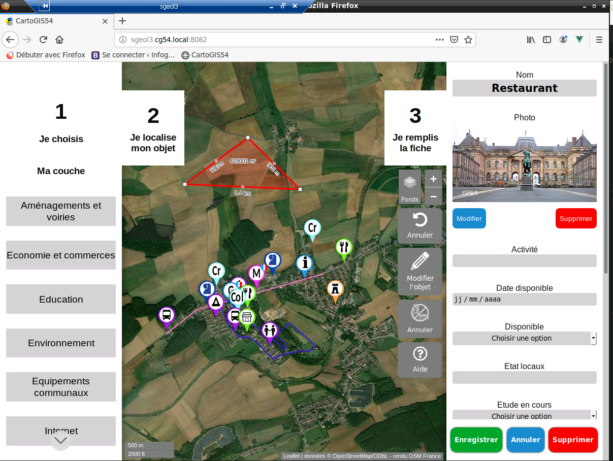

# Conclusion
Au terme de mon année d'alternance, mes supérieurs M. Vitoux et Mme Arts, sont satisfait de mon travail sur l'avancée du projet, et moi aussi par la même occasion.

Application en août 2021

Malgré une année ponctuée par le Covid, les confinements et le télétravail, j'ai pu assurer mon rôle de développeur Web au sein du SIG, ce qui a été bénéfique pour tous car mes collègues m'apportaient leurs connaissances en cartographie, QGIS et son environnement et pour moi, j'amenais mes idées et mon point de vue sur des améliorations, que je développais par la suite.

Cette année au Conseil départemental a été très enrichissante en terme :
- d'expérience professionnelle, car j'ai dû travailler en équipe avec M. Vitoux, avec des délais à respecter, des réunions etc.
- de communication, qui n'a pas été facilitée avec le télétravail et les confinements, 
- d'autonomie, étant donné que j'ai dû apprendre par moi-même de nouvelles technologies comme VueJS et NodeJS,
- d'expérience personnelle, au vu des nombreuses compétences que j'ai acquises, des qualités dont j'ai fait preuve, des problèmes et interrogations auxquels et j'ai pu faire face et des solutions que j'ai apporté. 

## Remerciements
Je tiens ainsi à remercier toutes les personnes m'ayant accueillies au Conseil Départementale et plus spécifiquement M. Vitoux, qui a su donner de son temps pour m'accompagner en tant que tuteur, ainsi que Rodolphe Drouet, qui m'a été d'une aide précieuse en ce qui concerne le plugin de configuration. 

Je leur souhaite à tous une bonne continuation.

Je vous remercie de m'avoir suivi jusqu'ici et vous souhaite à vous aussi une bonne continuation
