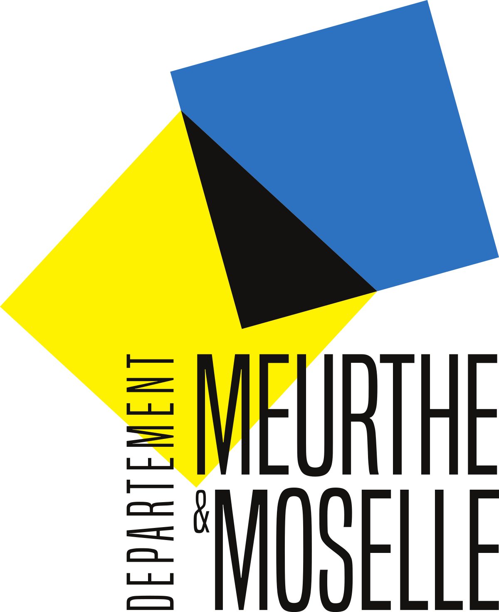
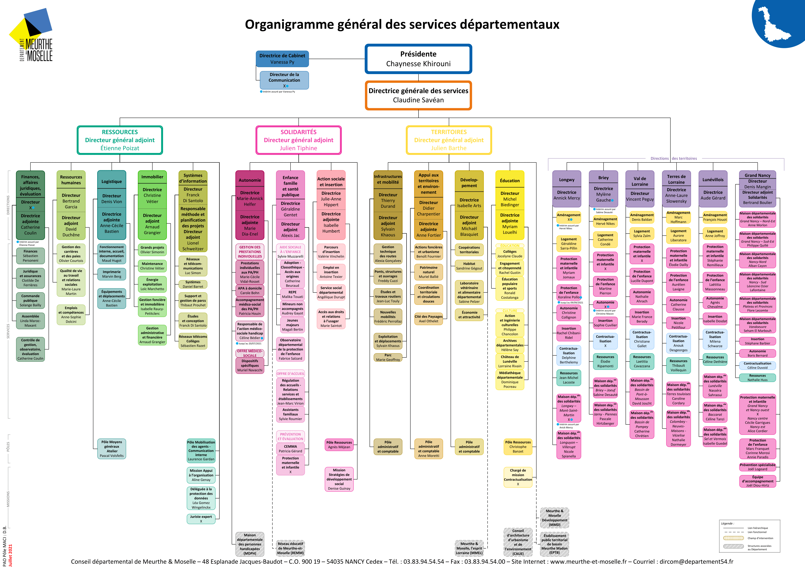

# Présentation
Durant l'année 2020-2021, j'ai intégré la __License Professionnelle Conception-Intégration d'Applications et Services Web pour l'Entreprise__ (LP CIAISE) de l'IUT Nancy-Charlemagne, formation professionnalisante dans le domaine du développement Web, la création d'applications et de sites Web

. J'ai eu l'occasion d'effectuer cette année d'étude en alternance au sein du __Système d'Information Géographique__ (SIG) du __Conseil Départementale de Meurthe-et-Moselle__ (CD54).

## Conseil départemental de Meurthe-et-Moselle

Logo du Département de Meurthe-et-Moselle

### Le rôle et les missions du Conseil départemental

Le Conseil Départemental, anciennement conseil général, est une institution française présente dans chaque département aux services des habitants, des collectivités, des communes et du territoire en général. 

Ses missions diverses concernent l'ensemble du territoire du département sur principalement les thématiques suivantes : 
- La solidarité envers l'enfance et la famille, les personnes en difficulté sociale, les personnes âgées, les personnes en situation de handicap.
- Le social avec la gestion du RSA et de certaines allocations,
- La gestion et l'entretien des routes départementales, de grandes infrastructures comme les aérodromes et les ports, etc.
- L'éducation avec la gestion et l'entretien des collèges, et le soutien aux universités, et le transport des élèves (de maternelle à lycée),
- L'économie et l'agriculture avec l'attractivité du territoire, du soutien à l'emploi, des laboratoires vétérinaires et alimentaires,
- La protection et la valorisation de la culture et du patrimoine, ainsi que le tourisme
- L'environnement avec l'eau et l'assainissement, sentiers de randonnées et la protection des espaces naturels.

### Organisation du Cd54
Suite aux élections départementales de 2021 des conseillers départementaux, ces derniers ont élu [__Chaynesse Khirouni__](http://meurthe-et-moselle.fr/departement/la-pr%C3%A9sidente), nouvelle présidente du Conseil départemental de Meurthe-et-Moselle, qui à succède __Valérie Beausert-Leick__.

Les missions du département sont réparties en 3 grands pôles : 
- __Solidarités__, regroupant les actions sociales et solidaires
- __Ressources__, pour le fonctionnement général du Conseil départemental (RH, Finances, Système informatiques, etc.)
- __Territoires__, pour les autres missions (Infrastructures, Éducation, Tourisme et Écologie, etc.)

Organigramme général du Cd54 de Juillet 2021

Bien que n'apparaissant pas sur le diagramme ci-dessus, le service SIG fait partie de la branche Développement du pôle Territoires. 

__Julien Barthe__ a pris le poste le directeur général adjoint du pôle Territoires au cours de l'année 2021 et la branche Développement est dirigée par __Isabelle Arts__. 

### Le service SIG
#### Composition
- __Hervé Vitoux__ - Chef de projet
- __Ingrid Leblanc__ - Administratrice fonctionnelle SIG et Formatrice SIG
- __Mohammed Boujjia__ - Administrateur fonctionnel SIG

#### Rôles et missions
Le Système d'information géographique a pour mission de collecter et stocker les objets géographiques du département.

Ces objets peuvent provenir des maires et des mairies, d'institutions publiques ou privées, de collectivités, ... toutes personnes pouvant renseigner ce genre de données. 

Les objets géographiques comprennent tous les objets, infrastructures, zones naturelles ou non. Cela concerne entre autres les routes et chemins, ronds-points, lignes électriques et fibres, parkings, terrains de sports et gymnases, commerces, hôpitaux, écoles, parcs et forêts et même les bouches à incendie, les bancs publics ou bien les zones de reproduction d'une certaine espèce de papillons : il s'agit de toutes informations pouvant être amenées à être cartographiées.

La seconde mission du SIG est de restituer ces informations sous forme de cartes pour les clients du SIG, des externes comme des collectivités et mairies ou d'autres services du département, comme par exemple le service gérant l'assainissement des eaux qui aimerait avoir une cartographie des installations souterraines afin de pouvoir intervenir le plus efficacement possible.

Ces cartes peuvent servir à conseiller et guider les clients dans leurs projets. Prenons l'exemple d'un maire qui veut construire un complexe sportif d'un côté de sa ville, le SIG pourra lui conseiller en lui signalant qu'un autre gymnase est à moins d'1 km et proposera de le mettre plutôt de l'autre côté de la ville. Autre exemple où un maire veut faire construire un parc/jardin public, le SIG pourra le conseiller de le déplacer car trop proche d'une station d'épuration ou d'une zone industrielle, ce qui pourrait déranger les futurs visiteurs du parc.

### L'importance de l'informatique
Au vu de la diversité de projets, de types d'objets, de la provenance de ces objets et de la multiplicité des acteurs, l'informatique a permis au SIG de :
- Stocker en base de données les objets, tout en uniformisant le format de chaque objet (indépendamment de son origine). Auparavant les objets pouvaient être renseignés au SIG par mail, sous forme de tableau (xls, odp, csv), dans un fichier texte etc., ce qui ne facilite pas le travail d'analyse,
- Créer des applications et d'outils facilitant la restitution, l'insertion et la modification d'objets.

### Le projet Bourg-centre
Le projet Bourg-centre a pour but la revitalisation des bourgs-centres. En effet, de nos jours, les grandes villes attirent toutes les activités, au péril des plus petites villes qui se dévitalisent dans un cercle vicieux : 
moins d'entreprise, moins d'habitants, moins de commerces, d'écoles et de services comme des centres hospitaliers, ce qui implique moins d'attractivité pour l'installation futures entreprises. 

Le but de ce projet est ainsi de redynamiser le centre de communes candidates, grâce à, par exemple, l'accès au Très Haut Débit, une aide pour les services de santé et les petits commerces. 

Le rôle de SIG dans ce projet est de récupérer toutes les infrastructures des communes concernées afin de pouvoir au mieux analyser leur situation actuelle et proposer des solutions adaptées.

La saisie de ces objets devra se faire par les mairies et non par le SIG, au vu du nombre d'objets à saisir pour chacune des communes concernées. Or l'outil utilisé pour la saisie d'objets géographiques est trop complexe pour être utilisé par quelqu'un ignorant le fonctionnement de l'outil.

D'où l'idée de créer une application simplifiant la saisie, la modification et la consultation d'objets cartographiques.
