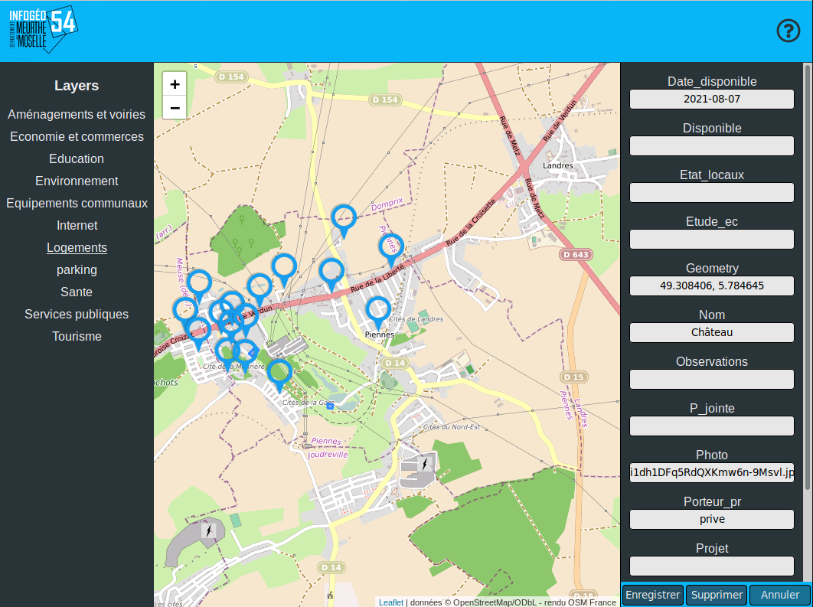

# Présentation de l'application existante
Cette partie reprend le fonctionnement général des applications créées par Hugo, je vous remets un [lien vers son rapport](https://alternance-hugo-jahnke.netlify.app/) si vous voulez plus de détails.
Le projet principal se nomme CartoGIS54 et se compose alors d'une application cliente et d'un plugin QGIS.

## L'application cliente

Il s'agit d'une application Web monopage, codée en VueJs et disponible librement sur [GitHub](https://github.com/infogeo54/CartoGIS54). 

Application CartoGIS54 en octobre 2020

Elle est configurable grâce à un fichier json généré par le plugin QGIS. C'est dans ce fichier qu'est inscrit, entre autres, le lien vers QGIS Serveur et ainsi que le lien vers le projet QGIS, pour ainsi consumer l'API grâce aux flux WMS et WFS.

 Cette API permet de récupérer, modifier, ajouter et supprimer des objets géographiques (ou features) dans la base de données PostGIS du serveur.
::: tip PostGIS
 *PostGIS est une extension du système de gestion de bases de données PostgreSQL, qui est spécialisée dans la manipulation d'objets géographiques*
:::

Après avoir récupéré ces objets depuis l'API, l'application les affiche sur une carte Leaflet.
::: tip Leaflet
*Leaflet est une librairie open-source Javascript qui permet de créer et gérer des cartes et d'y ajouter des objets comme des marqueurs ponctuelles, des lignes ou des polygones.*
:::

Les objets sont affichés selon le style défini dans le projet QGIS, c'est-à-dire la forme (marqueurs ponctuels, lignes, polygones), leur couleur ou une icône pour les points.

Chaque objet possède une liste d'attributs qui est définie dans le projet QGIS et qui sert à décrire cet objet. Prenons l'exemple d'un commerce : on pourrait avoir un attribut nom, un attribut horaires d'ouverture, etc. On peut consulter cette liste via l'application sous la forme d'un formulaire qui s'affichera sur la droite de l'application et que l'on a nommé "fiche descriptive". Cette fiche peut être ainsi consultée et remplie.

Afin de pouvoir ajouter un nouvel objet, nous devons sélectionner le type d'objet souhaité. Pour cela, nous sélectionnons dans la liste de couches à gauche de l'application celle que nous souhaitons. Au clic, les différents types d'objets de la couche apparaissent (avec pour les objets ponctuels leur marqueur personnalisé s’ils en ont un). Après avoir sélectionné le type souhaité, nous pouvons le positionner sur la carte Leaflet :
- Pour les objets ponctuels, il suffit de cliquer un fois à l'endroit souhaité pour le placer.
- Pour les polygones, lorsque nous cliquons, nous ajoutons un sommet à notre polygone. Cependant il n'y a pas moyen de modifier la forme (seulement d'ajouter des sommets à partir du dernier posé). 

La fiche descriptive apparait après un clic pour pouvoir être remplie.

## Le plugin CartoGIS54-config
L'application CartoGIS54 peut être configurée grâce au fichier app.config.json. Ce fichier peut être complétement créé grâce à un plugin de QGIS, créé en Python. Il permet ainsi de configurer l'application principale avec une interface simple. Peut être configuré :
- Le projet QGIS et le service Web hôte utilisés
- Le titre et l'image de l'en-tête
- Un ou plusieurs fenêtres modales
- Les différents champs du formulaire

Je n'ai pas eu à modifier personnellement ce plugin lors de mon alternance car mes missions se concentraient surtout sur l'application principale. Cependant le SIG a recruté un stagiaire, Rodolphe Drouet, pour la Réalisation de plugins pour le système d’information QGIS.

Rodolphe a, entre autres, modifié ce plugin en accord avec les améliorations que j'ai apportées à l'application principale. Si vous souhaitez avoir plus de détails, je vous propose d'aller consulter [son rapport ici](https://drive.google.com/file/d/1ecxuKktP6YYPCcpCltc1stMkZT2wNe9M/view?usp=sharing).
